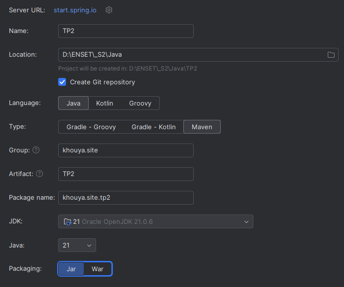
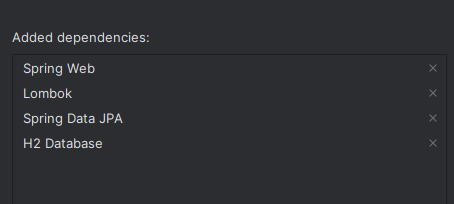
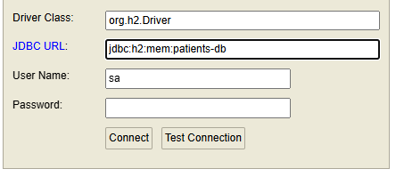
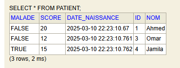
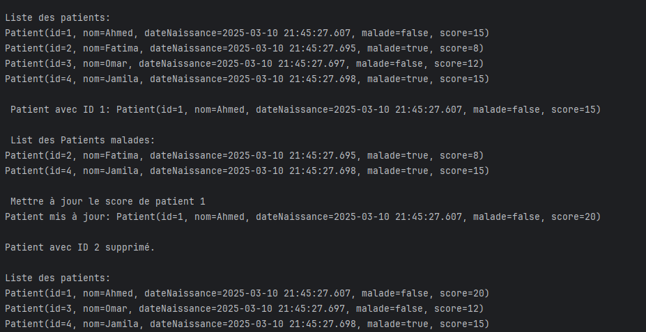

## Activité Pratique N°2 - ORM JPA Hibernate Spring Data

L'objectif de cette activité est de permettre au développeur de connecter son application à une base de données. Cela permet de persister les données même après l'arrêt de l'application.

### Creation Créer un projet Spring Initializer avec les dépendances JPA, H2, Spring Web et Lombock



### Creation de l'entité JPA Patient ayant les attributs suivantes:
```java
@Entity
@Data @NoArgsConstructor @AllArgsConstructor @Builder @ToString
public class Patient {
@Id
@GeneratedValue(strategy = GenerationType.IDENTITY)
private Long id;

    private String nom;
    private Date dateNaissance;
    private boolean malade;
    private int score;
}
```
### Configuration de l'unité de persistance dans le ficher application.properties
```properties
server.port=8086
spring.datasource.url=jdbc:h2:mem:patients-db
spring.h2.console.enabled=true
```
- Pour accéder à votre base de données H2, entrez http://localhost:8086/h2-console dans votre navigateur, tapez le bon JDBC URL puis Connect




### Creation de l'interface JPA Repository basée sur Spring data
```java
public interface PatientRepository extends JpaRepository<Patient, Long> {
    List<Patient> findByMalade(boolean malade);
}
```

### Teste de quelques opérations de gestion de patients :
Pour tester notre code, on utilise CommandLineRunner et @Bean pour executer notre code au debut.
 


```java
  @Bean
    CommandLineRunner runner() {

        return args -> {
            // Ajouter des patients avec le Builder
            patientRepository.save(Patient.builder()
                    .nom("Ahmed")
                    .dateNaissance(new Date())
                    .malade(false)
                    .score(15)
                    .build());

            patientRepository.save(Patient.builder()
                    .nom("Fatima")
                    .dateNaissance(new Date())
                    .malade(true)
                    .score(8)
                    .build());

            patientRepository.save(Patient.builder()
                    .nom("Omar")
                    .dateNaissance(new Date())
                    .malade(false)
                    .score(12)
                    .build());

            patientRepository.save(Patient.builder()
                    .nom("Jamila")
                    .dateNaissance(new Date())
                    .malade(true)
                    .score(15)
                    .build());

            // Consulter tous les patients
            System.out.println("\nListe des patients:");
            patientRepository.findAll().forEach(System.out::println);

            // Consulter un patient par ID
            Patient patient = patientRepository.findById(1L).orElse(null);
            System.out.println("\n Patient avec ID 1: " + patient);

            // Chercher des patients malades
            System.out.println("\n List des Patients malades:");
            patientRepository.findByMalade(true).forEach(System.out::println);

            // Mettre à jour un patient 1
            System.out.println("\n Mettre à jour le score de patient 1");
            if (patient != null) {
                patient.setScore(20);
                patientRepository.save(patient);
                System.out.println("Patient mis à jour: " + patient);
            }

            // Supprimer un patient
            patientRepository.deleteById(2L);
            System.out.println("\nPatient avec ID 2 supprimé.");

            // Consulter tous les patients
            System.out.println("\nListe des patients:");
            patientRepository.findAll().forEach(System.out::println);
        };
    }
```
---
